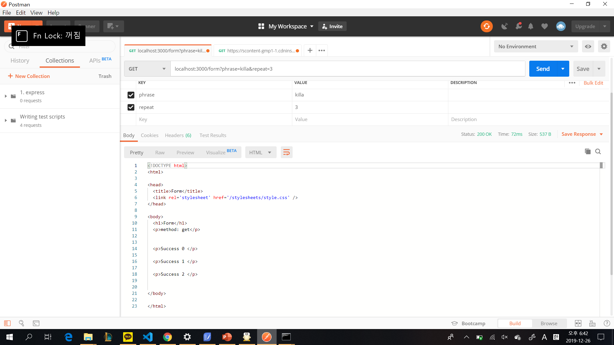
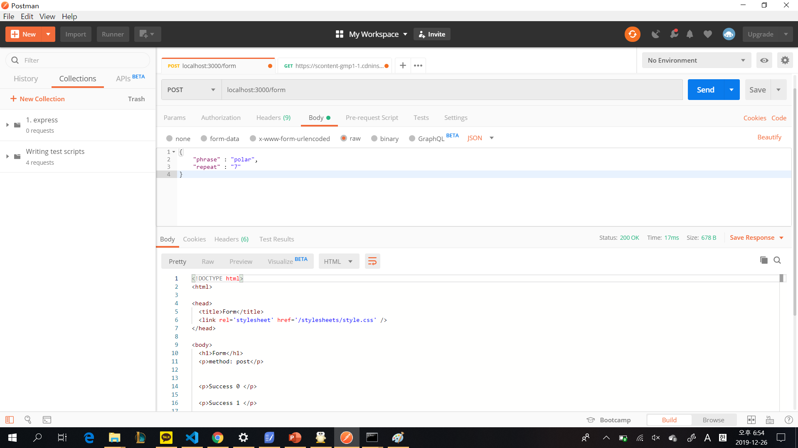
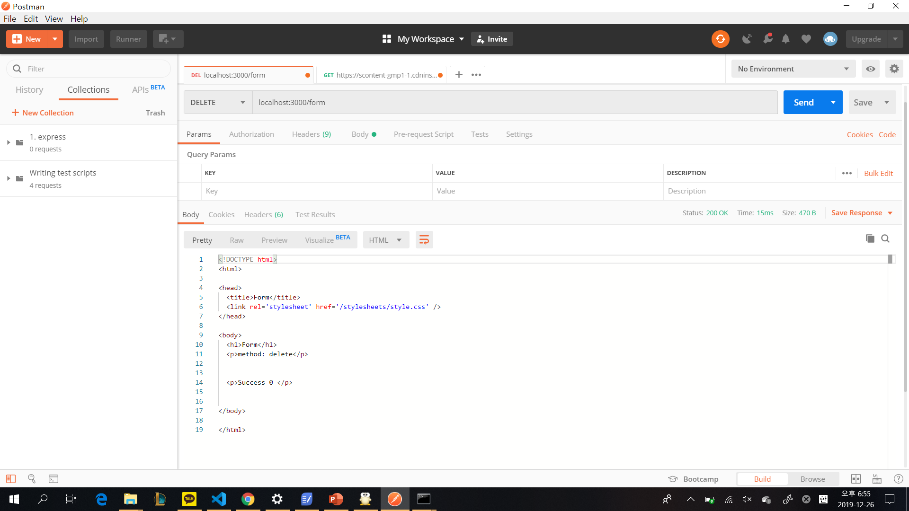
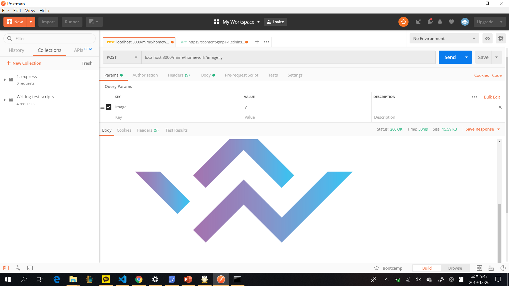
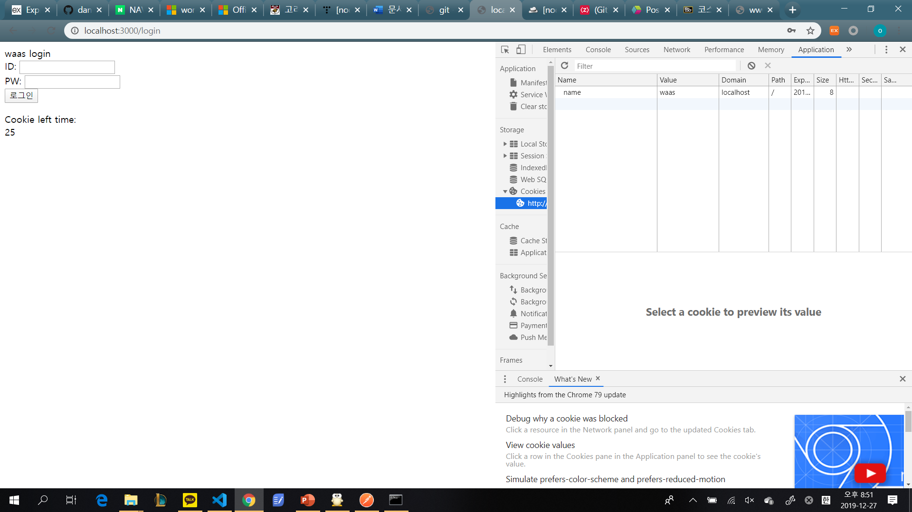
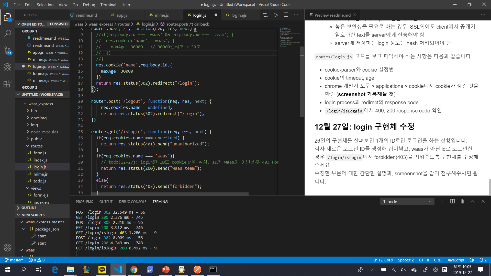
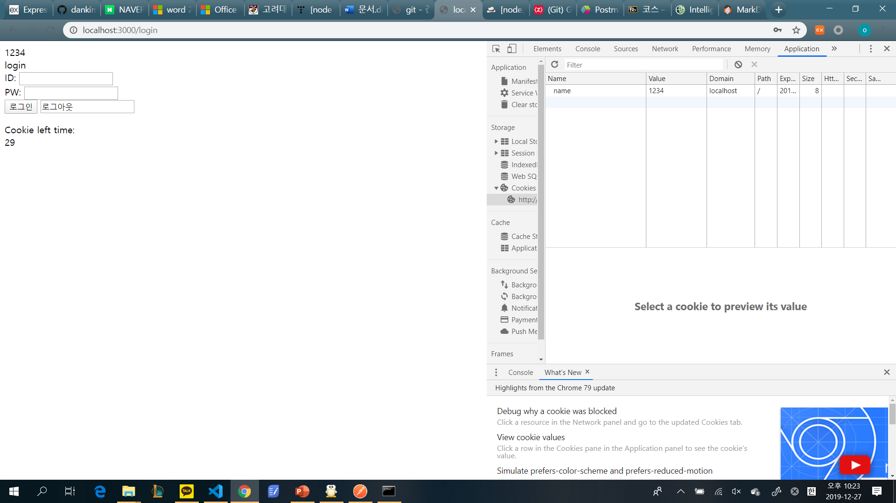
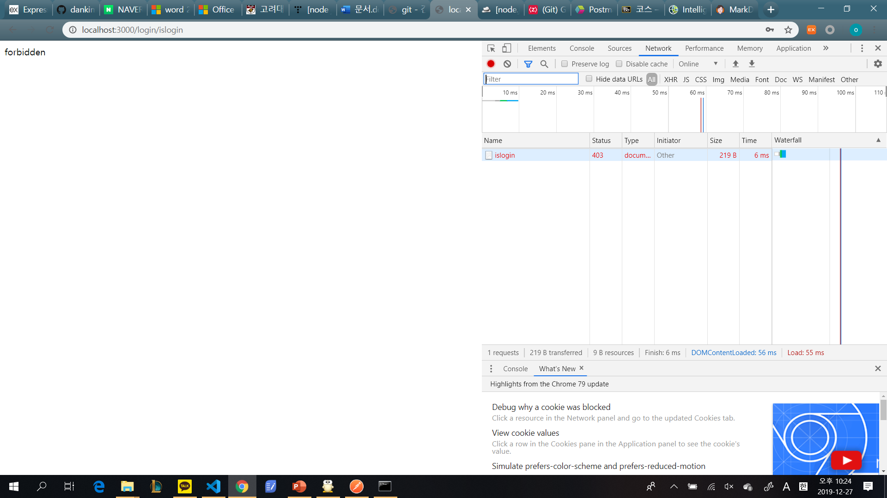

### 12월 23일?
* todo list의 제목을 "HelloTODO"로 하기 위해서는 localhost:3000/todo?title=HelloTODO로 접근해야함

### 12월 24일?
* 1. localhost:3000/form?phrase=killa&repeat=3

* 2. localhost:3000/form
body(json) = 
{
    "phrase":"polar",
    "repeat":"7"
}

* 3. localhost:3000/form
body(json) =
{
    "phrase":"pocky",
    "repeat":"5"
}

* 4. localhost:3000/form


### 12월 25일?
* post, text/plain, image="y"


### 12월 26-27일?
* id:waas, pw:team으로 로그인했을 시 cookie가 생긴 것을 확인


```javascript
if(req.body.id === 'waas' && req.body.pw === 'team') {
    res.cookie('name', 'waas', {
      maxAge: 30000   // 30000밀리초 → 30초
    })
}
```
부분을 지우고
```javascript
res.cookie('name',req.body.id,{
    maxAge: 30000
})
```
부분을 추가해서 어떠한 id, pw가 입력되어도 일단 쿠키에 저장
```javascript
router.get('/isLogin', function(req, res, next)
```
부분의 안쪽을

```javascript
if(req.cookies.name === undefined) {
    return res.status(401).send("unauthorized");
  }
  if(req.cookies.name === 'waas'){
    // todo(12-27): login한 ID로 cookie값을 설정, ID가 waas가 아닌경우 403 Forbidden 공지
    return res.status(200).send("waas team");
  }
  else{
    return res.status(403).send("forbidden");
  }
}
```
으로 바꿔 cookie가 undefined이면 401에 unauthorized, cookie.name === waas이면 200을, cookie.name 가 존재는 하지만 waas가 아니라면 403을 전송함.

따라서 다음처럼 id=1234로 로그인을 해 /islogin에 접속하면


403이 뜨게 된다.